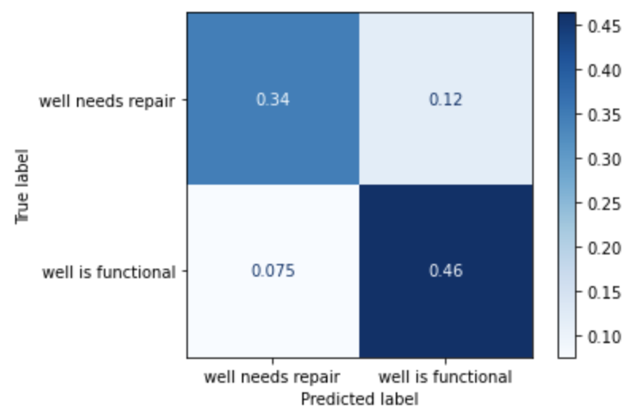

# Tanzania Water Wells

Phase 3 Project, Flatiron

## Overview

For our project, we wanted to deliver a model to the government of Tanzania to help them predict the functionality of water wells. We used data from 59,400 wells that were previously recorded. Since the target was binary, we tried multiple classification models. Our final model ended up being a Random Forest Tree classifier. It had a precision score of 0.8 and was also not overfit to the training data. We focused on precision because we wanted to minimize the cost of a false positive result. In the end, we recommend the government of Tanzania us our model to predict the functionality of wells that it hasn't seen, and to take note of important features in case it wants to build more water wells in the future. 

## Business Problem

As a developing country, it isn't given that the people of Tanzania will have fresh water. We want to be able to predict the functionality of water wells in Tanzania. This will help the Government of Tanzania focus their time and resources on repairing certain wells.

- Who are your stakeholders?
    - Stakeholders are the Government of Tanzania who will help fund and maintain the water wells.
- What are your stakeholders' pain points related to this project?
    - Their pain points are wasted resources on wells and not delivering enough water to the people of Tanzania.
- Why are your predictions important from a business perspective?
    - They are important because they allow us to allocate resources in the best way. Ultimately, the priority is giving clean water to the people of Tanzania.
- What exactly is your deliverable: your analysis, or the model itself?
    - Our deliverable is the model itself. We used a Random Forest Classifier model and its precision score to show which wells were functioning. This in turn allowed us to understand which wells needed to be maintained.
- Does your business understanding/stakeholder require a specific type of model?
    - They do not need a specific type of model. The model itself is the deliverable. Being able to predict which wells are functioning from the model is the key. This allows us to use a stronger, more complex model
- What does a false positive look like in this context?
    - A false positive in this context is a well that needs repair but is predicted to be functioning.
- What does a false negative look like in this context?
    - A false negative in this context is a well that is functioning but is predicted to need repair.
- Which is worse for your stakeholder?
    - The thing that is worse for the stakeholders is a false positive. They are trying to repair the wells and ignoring one that isn’t operational is bad for the people of Tanzania.
- What metric are you focusing on optimizing, given the answers to the above questions?
    - We are focusing on optimizing precision throughout this modeling.
    
## Data Preparation

We did 2 Train_Test_Splits. The first was to create a dataset that we would hold until the very end to evaluate our final model. The second split was on the data that wasn't held til the end (`X_use`). This allowed us to evaluate our model while preventing Data Leakage. 

- Were there variables you dropped or created?
    - There were multiple columns that had overlap with each other. We took out the redundancy to make the data cleaner and easier to work with. We also took out columns that had no impact on well functionality. If you look at the cell of code that creates a list of unused columns, we put a comment of why each one was dropped. 
- How did you address missing values or outliers?
    - We used a Simple Imputer to insert missing values.
- Why are these choices appropriate given the data and the business problem?
    - These choices are appropriate because we are working with discrete data and not continuous.
- Can you pipeline your preparation steps to use them consistently in the modeling process?
    - Yes a pipeline was built so that consistency was achieved, streamlining the process for training and testing the data.
    
## Modeling

We each ran multiple models while tuning the hyperparameters in order to achieve the best results. The multiple models we ran include Logistic Regression, Decision Tree Classifier, Random Forest Classifier, and K-Nearest Neighbors.

- How will you analyze the data to arrive at an initial approach?
    - Before we begin modeling, we looked at our baseline understaning. If our model predicted a well was functional every time, it would be accurate 54% of the time. Knowing this, our initial approach will be to run a simple Logistic Regression model. 
- How will you iterate on your initial approach to make it better?
    - We ran untuned Decision Tree Classifier, K-Nearest Neighbors, and Random Forest Classifier models. Then we will tune the hyperparameters using a GridSearchCV with the goal of increasing our precision while not overfitting to the training data. 
- What model type is most appropriate, given the data and the business problem?
    - Since the target is binary, our models will be classification. And since our goal is to deliver a model and not just analysis, we care little about how to interpret the model. This means that we aren't limited to logistic regression or a simple decision tree, both of which are easy for interpretation. We can run complicated, non-parametric models like a K nearest neighbors or Random Forest Classifier model. 
    

## Evaluation 

After each model we ran, we predicted what the outcome would be. Then we compared our predicted data with the real target values. This allowed us to evaluate how well each model was performing. The specific metric we would look at is the precision score. We used precision score because it is worse for us to predict a well is function when it's in need of repair. We also wanted to check the scores on the training set because we didn't want to overfit our models.

- How do you interpret the results?
    - We used precision score to interpret the results. We also looked at Accuracy and Roc-Auc score since it was easy to code but it wasn't our main priority. It was only used to enhance our belief in the precision score.
- How well does your model fit your data? How much better is this than your baseline model? Is it over or under fit?
    - Our baseline line model was an untuned Decision Tree Classifier. Since the hyperparameters weren't tuned, it was overfit to our training data. For every model iteration after that, we compared the precision score of the training and testing datasets to decide which model was best.
- How well does your model/data fit any relevant modeling assumptions?
    - As for the assumptions of Linear modeling, we weren't too concerned with multicollinearity because we used a Logistic Regression that uses an L2 penalty for regularization. As for our other models like KNN and Random Forest Classifier, they didn't have any modeling assumptions. Ultimately, since our deliverable was the model itself, we weren't concerned about analyzing how each coefficient effected the prediction.
- How confident are you that your results would generalize beyond the data you have?
    - We are confident that our final model would be generalizable beyond our training data because the precision score on the training and testing sets were very similar (only off by ~0.02).
- How confident are you that this model would benefit the business if put into use?
    - We are confident that our final model would benefit the business if put to use because we believe 80% precision score is high.
- What does this final model tell you about the relationship between your inputs and outputs?
    - Our inputs do have an effect on predicting the outputs. Our most important features for the final model was if the quantity of the well was dry, the year the well was constructed, and ward in which it is located.
    
## Conclusions

Our final model that performed best was a Random Tree Classifier with class_weight='balanced', max_depth=35, min_samples_leaf=10, and n_estimators=50. It had a precision score = 0.8, accuracy = 0.81, and a roc-auc score = 0.89 on the hold out set. 

- What would you recommend the business do as a result of this work?
    - They can also look at which features were important in our final model in order to help construct better wells in the future. 
- How could the stakeholder use your model effectively?
    - The government of Tanzania can gather more information on wells in order to use our model to better predict it's functionality.
- What are some reasons why your analysis might not fully solve the business problem?
    - Lack of enough information might be one reason why our model doesn't solve the business problem. There might also be some underlying social-economic factors that aren't accounted for in the data. 
- What else could you do in the future to improve this project (future work)?
    - We could spend more time preparing the data in order to clean it more. We could also run more models with larger Grid Searches if we had more time. Lastly, we could run more complex models like Neural Networks if we had time to gain expertise on using them or hire an outsider who is fluent in neural networking code.
